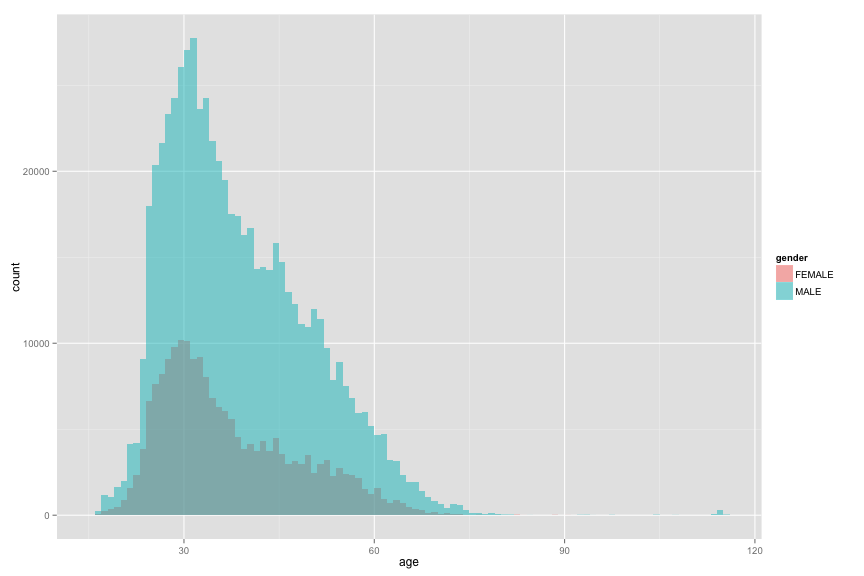
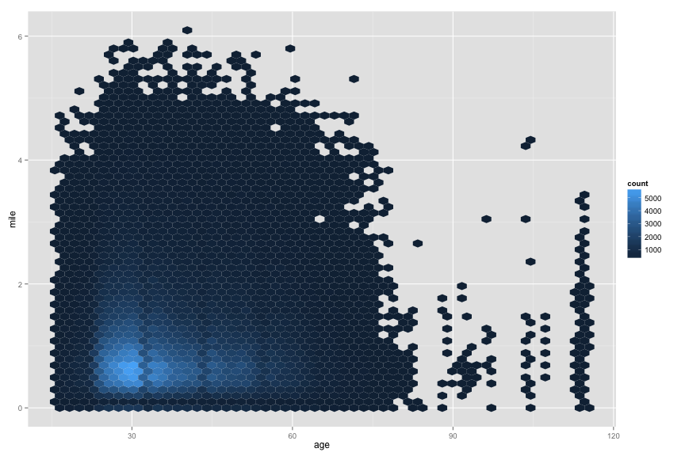
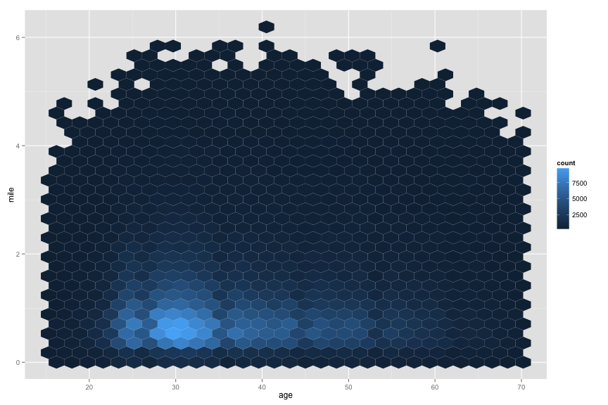
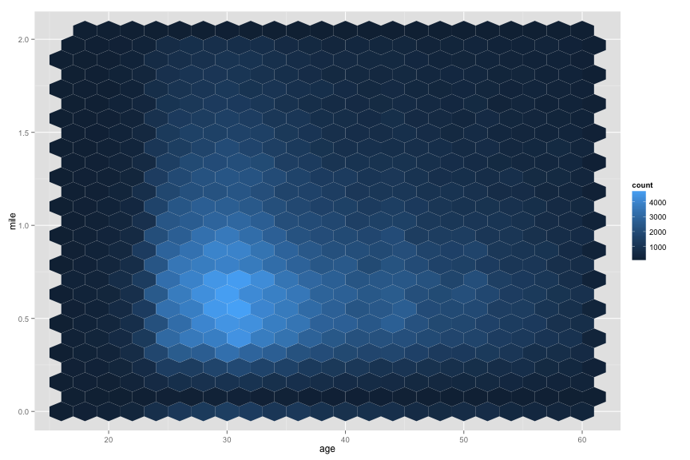
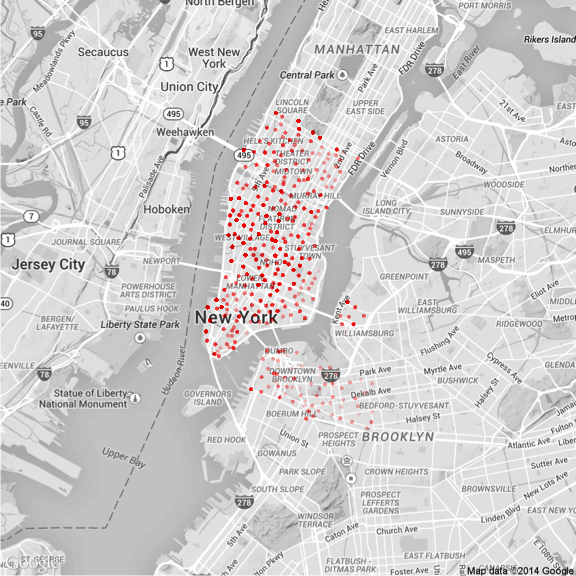
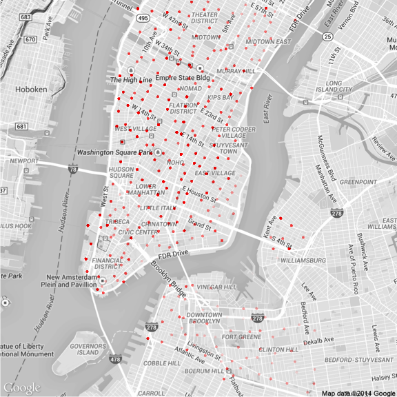
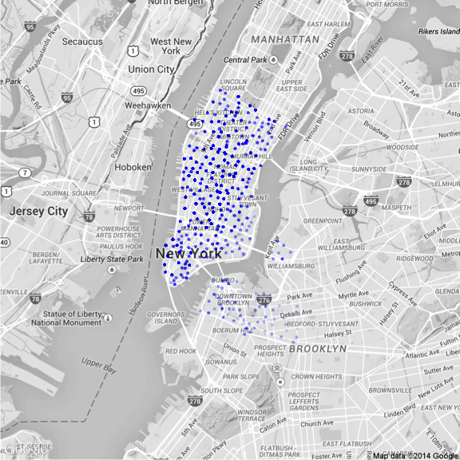
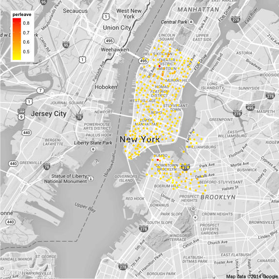
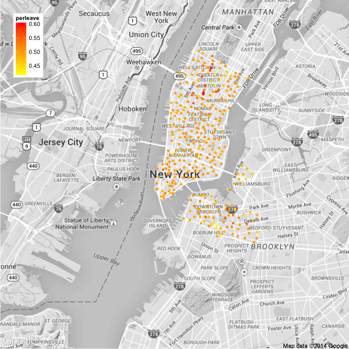
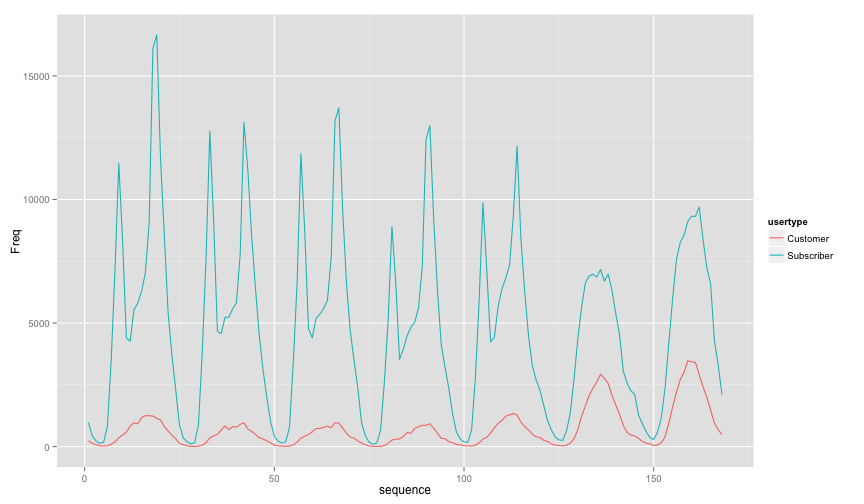

Citi Bike Use
========================================================
Jonathan Campbell and Rachel Smith 

12-18-2014

Citi Bike Data
========================================================
Citi Bike furnishes public data that details every trip taken since the beginning of the program. 

Notably, the data has already been processed by citibike. They took out all trips under 60 seconds (under the assumption that they might be false starts or people trying to re-dock a bike to make sure it was secure), trips by staff members moving bikes, and trips from "test" stations.

Available Data
========================================================
The data contains the following elements:
 - trip duration
 - start/end time and date
 - start/end station name, ID, latitude/longitude
 - bike ID
 - user type (customer = 24h/7d pass, subscriber = annual subscriber)
 - gender
 - year of birth

Research Questions
========================================================
We're interested in evaluating citibike riders, ridership, and revenue.

We chose June 2014 because it is recent enough to be interesting but the ridership is probably not as distorted by heat as July and August and so is probably a better representation of year-round behavior.

Setting up variables
========================================================
We created variables for the age of riders and the distance between start and end stations (as the crow flies):


```r
table(is.na(june$birth.year), june$usertype=="Subscriber") ##more or less, only subscribers have birthdays in the data
june$age <- 2014-as.numeric(june$birth.year)

june$mile <- gdist(june$start.station.longitude, june$start.station.latitude, june$end.station.longitude, june$end.station.latitude, units="miles")
```

Who rides Citi Bike?
===========================
This plots the age and gender of citibike riders:

```r
histogram <- june[,c("age","gender")]
histogram$gender=mapvalues(histogram$gender, from = c(0,1,2), to = c(NA,"MALE","FEMALE"))
histogram <- na.omit(histogram)
age.hist <- ggplot(histogram, aes(x=age, fill=gender)) + geom_histogram(binwidth=1, alpha=.5, position="identity") #by gender
```

Who rides Citi Bike?
===========================
This plots the age and gender of citibike riders:
 


What are rides like?
==========
A hexplot of age versus distance: improbably aged outliers, hard to see patterns in hot spot:

```r
#first attempt at a hexplot for age v distace
hexplot <- june[,c("mile","age")]
hexplot<-na.omit(hexplot)
agehex1 <- ggplot(hexplot, aes(x=age, y=mile)) + stat_binhex(bins=54)
```

What are rides like?
==========
A hexplot of age versus distance: improbably aged outliers, hard to see patterns in hot spot:
 

What are rides like?
===========
Cutting off the age range at 70:

```r
#Cutting off the age range at 70
hexplot1<-hexplot
hexplot1$age<-ifelse(hexplot1$age>70,NA,hexplot1$age) #age cut off at 70
hexplot1<-na.omit(hexplot1)
agehex2 <- ggplot(hexplot1, aes(x=age, y=mile)) + stat_binhex()
```

What are rides like?
===========
Cutting off the age range at 70:
 

What are rides like?
============
Too zoom in further, we limit the range to 2 miles and 60 years old:

```r
hexplot2<-hexplot1
hexplot2$mile<-ifelse(hexplot2$mile>2,NA,hexplot2$mile) 
hexplot2$age<-ifelse(hexplot2$age>60,NA,hexplot2$age) #age cut off at 70
hexplot2<-na.omit(hexplot2)
agehex3 <- ggplot(hexplot2, aes(x=age, y=mile)) + stat_binhex(bins=22)
```

What are rides like?
============
Too zoom in further, we limit the range to 2 miles and 60 years old:
 


What is ridership like across the city?
======================
This code plots the frequency of trips started at stations on  June 15, a Sunday; and June 16, a Monday:

```r
june15 <- june[june$starttime==as.Date("2014-06-15"),]
june16 <- june[june$starttime==as.Date("2014-06-16"),]
june15map <- qmap(c(lon = -73.986029, lat = 40.721111), zoom=12, color = "bw", legend = "topleft") + geom_point(data=june15, aes(x=start.station.longitude, y=start.station.latitude), alpha=0.01, col="red")
june15zoom <- qmap(c(lon = -73.986029, lat = 40.721111), zoom=13, color = "bw", legend = "topleft") + geom_point(data=june15, aes(x=start.station.longitude, y=start.station.latitude), alpha=0.01, col="red")
june16map <- qmap(c(lon = -73.986029, lat = 40.721111), zoom=12, color = "bw", legend = "topleft") + geom_point(data=june16, aes(x=start.station.longitude, y=start.station.latitude), alpha=0.01, col="blue")
june16zoom <- qmap(c(lon = -73.986029, lat = 40.721111), zoom=13, color = "bw", legend = "topleft") + geom_point(data=june16, aes(x=start.station.longitude, y=start.station.latitude), alpha=0.01, col="blue")
```

What is ridership like across the city?
======================
Plots of ridership on June 15, a Sunday; opacity refers to frequency:

 

What is ridership like across the city?
======================
Plots of ridership on June 15, a Sunday; opacity refers to frequency, zoomed in:

 

What is ridership like across the city?
======================
Plots of June 16, a Monday; opacity refers to frequency:

 

What is ridership like across the city?
======================
Plots of June 16, a Monday; opacity refers to frequency, zoomed in:

 

What is ridership like across the city?
======================
This code build a plot to show the proportion of bike transactions that are bikes leaving the station (the service moves bikes between stations manually to address this inequality):

```r
df1<-data.frame(table(june$start.station.name))
df2<-data.frame(table(june$end.station.name))
station<-merge(df1,df2,by.x="Var1",by.y="Var1")   
colnames(station)<-c("name","start","end")
station$perleave<-station$start/(station$start+station$end)
station$perarrive<-station$end/(station$start+station$end) 
stationsunique <- june[!duplicated(june$start.station.name),]
start.proportion <- merge(station, stationsunique, by.x="name", by.y="start.station.name")
start.proportion <- start.proportion[,c("perleave", "start.station.latitude", "start.station.longitude")]
```


What is ridership like across the city?
======================
The percentage of bike transactions that are bikes leaving the station:

 

What is ridership like across the city?
======================
Excluding top two outlying stations:

 

Where does revenue come from?
=====================
Calculating the fines for each person and summed by day of the week:

```r
charge1<-function(x){
  b<-(x/60)-45
  z <- (b%/%30)
  y<-0
  ifelse(b<0,y<-0,
            ifelse(b<=30,y<-2.5,y<-z*9))
return(y)}
charge2<-function(x){
  b<-(x/60)
  z <- (b%/%30)
  y<-0
  ifelse(z==0,y<-0,
         ifelse(z==1,y<-4,
                ifelse(z==2,y<-13,y<-13+12*(z-2))))
return(y)}
```
Where does revenue come from?
=====================
Calculating the fines for each person and summed by day of the week:

```r
pay<-matrix(nrow=nrow(june),ncol=1)
for (i in 1:nrow(june)){
  ifelse(june[i,"usertype"]=="Customer",
          pay[i]<-charge2(june[i,"tripduration"]),
          pay[i]<-charge1(june[i,"tripduration"]))}
june$pay<-pay
june$day <- weekdays(as.Date(june$starttime))
june$hour <- substr(as.character(june$starttime),12,13)
june$dh <- paste(june$day,june$hour)
juneweek <- aggregate(june$pay, list(time=june$dh), sum)
juneweek <- data.frame(juneweek,c(97:120,1:24,121:144,145:168,73:96,25:48,49:72))
```

Where does revenue come from?
=====================
Calculating the fines for each person and summed by day of the week:

```r
juneweek.s <-june[june$usertype=="Subscriber",]
juneweek.s <- aggregate(juneweek.s$pay, list(time=juneweek.s$dh), sum)
juneweek <- merge(juneweek,juneweek.s,by.x="time",by.y="time")
juneweek.c <-june[june$usertype=="Customer",]
juneweek.c <- aggregate(juneweek.c$pay, list(time=juneweek.c$dh), sum)
juneweek <- merge(juneweek,juneweek.c,by.x="time",by.y="time") 
colnames(juneweek)<-c("period","pay","time", "subscriber", "customer")  
```

Where does revenue come from?
=====================
Plot of revenue by the day of the week:


```r
plot(pay ~ time, data=juneweek)
```

 


Who rides Citi Bike?
============
This plot shows the frequency of ridership by hour:
 

Where does revenue come from?
=====================
Plot of revenue by subscriber type and day of week:
http://embed.plnkr.co/jud4z0Gouoa0UWKpJ0oH/preview
